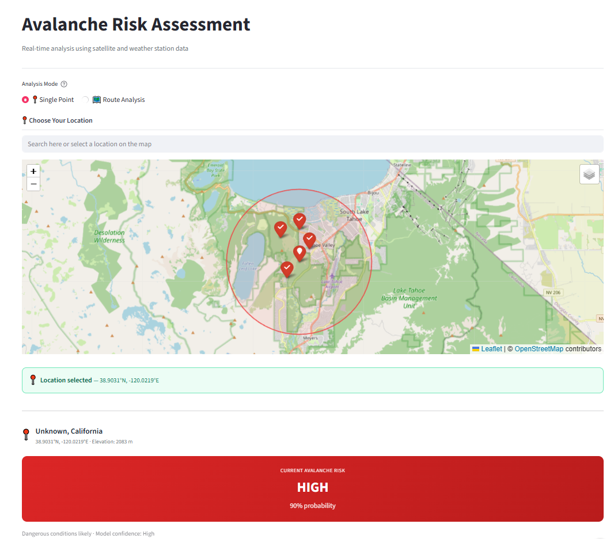

# Avalanche Risk Forecasting

A physics-informed neural network (PINN) that estimates avalanche risk from snowpack and
weather features, tuned to prioritize **recall** so that real avalanche conditions are
rarely missed.

**Live demo:** [apps.leonzhao.dev/avalanche](https://apps.leonzhao.dev/avalanche/) (always on, no cold start)

Featured in context at [leonzhao.dev/ai/avalanche](https://leonzhao.dev/ai/avalanche/).



## The approach

The model is a **physics-informed neural network** built in TensorFlow/Keras. Alongside the
usual data-driven loss, it incorporates snow-physics terms (incoming/outgoing longwave
radiation energy balance) so its predictions stay consistent with how snowpacks actually
behave, not just with the training labels.

Design choices that matter for a safety application:

- **Recall-weighted training.** Missing a real avalanche is far worse than a false alarm,
  so the loss uses a focal objective weighted toward catching positives (high recall).
- **KNN imputation for missing inputs.** Real-world feature vectors are often incomplete.
  A KNN imputer, fit on the bundled training datasets (`data/`), fills in missing features
  from the most similar historical conditions before the model runs.
- **Pre-fit scaler and imputer** (`models/`) ship with the repo, so inference is fully
  self-contained and works offline.

## Results

| Metric | Value |
|---|---|
| Recall (avalanche class) | **95.9%** |
| Accuracy | **97.4%** |
| Model | Physics-informed NN (TensorFlow) |

## Repository layout

```
app.py                  Streamlit inference app
models/                 trained weights + config + scaler + imputer + threshold
data/                   4 training datasets (feed the KNN imputer at inference)
notebooks/training.ipynb   model training
```

## Run it locally

```bash
pip install -r requirements.txt
streamlit run app.py
```

Then open the URL Streamlit prints (default http://localhost:8501).

## License

[MIT](LICENSE).
